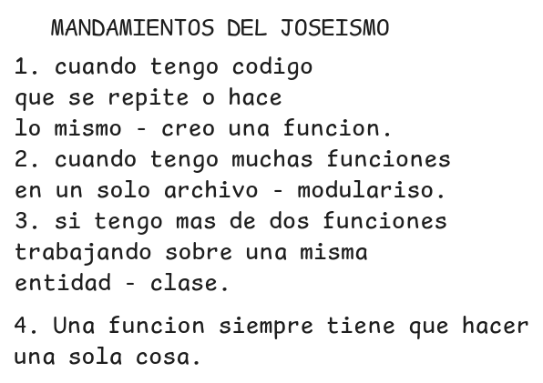

# APP MATRICULAS EN PYTHON 
Esta aplicación nos ayudará a tener un mayor control de las matrículas de nuestros alumnos.
## ¿Que podrás hacer con mi aplicación?
- Registrar alumnos.
- Generar fichas de matrículas.
- Mostrar la lista de todos los matriculados.
- Filtrar matriculados por programa de estudio.
## Tecnologías
- Python
- SQLite
- Pydantic
- FastApi
## Arquitectura
- Arquitectura MVC
- Arquitectura Limpia
## Metodología de Trabajo
- Scrum
- XP (eXtreming Programming)
## Pasos Iniciales
1. Crear la carpeta del proyecto.
bash
mkdir app_matricula_python

2. Acceder a la carpeta de proyecto.
bash
cd app_matricula_python

3. Inicializar nuestro repositorio.
bash
git init

4. Crear nuestro entorno virtual.
bash
python -m venv app_matricula_python   # se pone el nombre con el que creamos nuestro entorno virtual

5. Activar el entorno virtual.
bash 
source app_matricula_python/Scripts/activate

*Paso opcional*
Para desactivar mi entorno virtual
bash
deactivate

 """
- Registrar alumnos.
- Generar fichas de matrículas.
- Mostrar la lista de todos los matriculados.
- Filtrar matriculados por programa de estudio.
"""
Lista_Alumnos=[]

Nombre=input("Ingrese su nombre:")
Apellido=input("Ingrese su apellido:")
Nombre2=input("Ingrese su nombre2:")
Apellido2=input("Ingrese su apellido2:")
Lista_Alumnos.append(Nombre)
Lista_Alumnos.append(Apellido)
Alumno={
    "Nombre":Nombre,
    "Apellido":Apellido
}
Alumno2={
    "Nombre":Nombre2,
    "Apellido":Apellido2
}
Lista_Alumnos.append(Alumno)
Lista_Alumnos.append(Alumno2)
#fin del problema

#deseo mostrar un menú con las opciones de agregar un nuevo alumno y salir del programa.
print(Lista_Alumnos)

